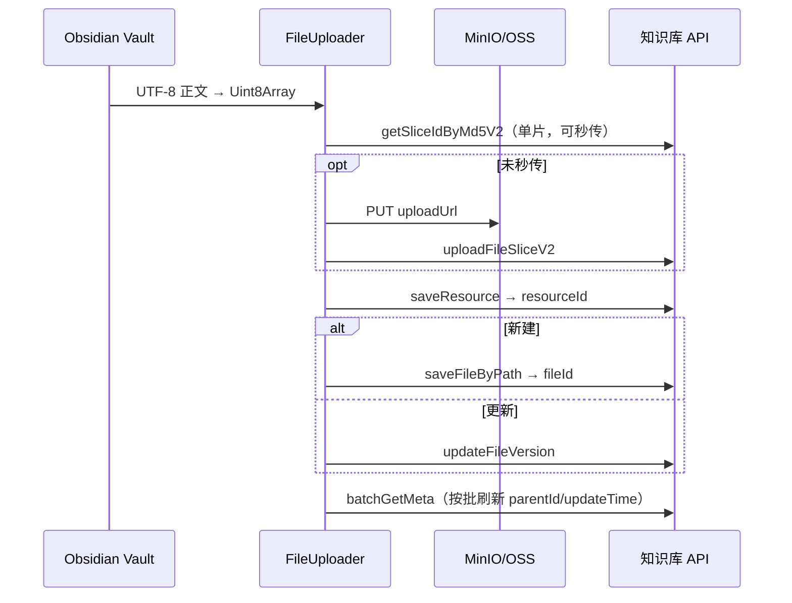
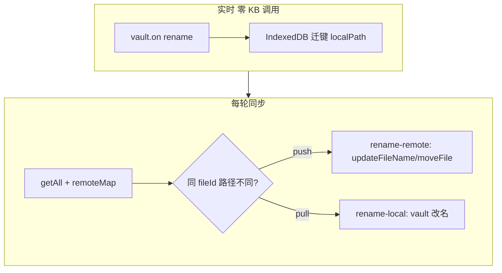

# Obsidian XGKB Sync：上传与移动/重命名改造方案

> **状态**：U1/U2/M1/M3 已实施（v2.0.6+）；**可进入 Milestone-1 手测**；M2 待做  
> **版本**：2026-05  
> **关联**：[physical-upload-migration-plan.md](./physical-upload-migration-plan.md)、[sync-pipeline-and-watermark.md](./sync-pipeline-and-watermark.md)  
> **参考**（非照搬）：`github-openclaw-xgkb-sync` 的 `fileUploader.ts`、`syncEngine.ts Phase 1/1.5`

---

## 1. 背景

### 1.1 当前实现

| 环节 | 实现 | 问题 |
|------|------|------|
| 上传新建 | `uploadContent` | 纯文本通道，与 OSS 下载不对称 |
| 上传更新 | `uploadContent` + `updateFileId` | 同上 |
| 下载 | `getDownloadInfo` → OSS 直链 | 已改造 |
| 改名/移动 | **无** | 退化为 delete + upload，API 多、fileId 断裂 |

### 1.2 设计原则（Obsidian 特化）

1. **不移植 openclaw inode 对账**（移动端/Windows 无可靠 inode）。
2. **用 `xgkbFileId` + Vault 事件** 处理 rename/move，零额外 list API。
3. **稳定性优先**：物理上传失败可降级 `uploadContent`；rename 失败记 failed，不 delete+upload。
4. **控制 KB 调用次数**：批量 meta、上传并发保守、rename 串行。

---

## 2. 上传与更新（重点一）

### 2.1 目标链路



### 2.2 与 openclaw 的差异

| 项 | openclaw | Obsidian 插件 |
|----|----------|---------------|
| 上传并发 | 3 | **2**（单 appKey + 主线程，更保守） |
| 兜底 | 无 uploadContent | **保留 uploadContent 降级**（设置项，默认开） |
| 调度/令牌桶 | 有 | **不做**（单作用域，批间 pause 200ms） |
| 大文件分片 | 完整 | **MVP 单片 ≤5MB**；更大文件 P3 |

### 2.3 API 调用量（性能）

典型 `.md` 单次 push（无秒传）：约 4 次 KB 调用 + 1 次 MinIO PUT。  
**仅对 decide 为 upload 的文件执行**，已同步路径 skip，不全量重传。

| 优化 | 说明 |
|------|------|
| 秒传 | `getSliceIdByMd5V2` 命中则跳过 PUT |
| batchGetMeta | 上传批次结束后按 50 条合并查询 |
| 并发 2 | 降低 429 |
| uploadContent 兜底 | 物理失败时 1 次调用，保证可用 |

### 2.4 模块

| 文件 | 职责 |
|------|------|
| `fileUploader.ts` | bytes → resourceId → saveFileByPath / updateFileVersion |
| `xgkbApi.ts` | 分片 + 入库 API |
| `fsXgkb.ts` | createFile / updateFile 改调 FileUploader |
| `md5.ts` | 分片 MD5（Web 环境无 Node crypto） |

### 2.5 幂等与失败

- `saveFileByPath` **非幂等**：禁止对同一路径盲重试 create。
- 失败：`syncStatus=failed` + `lastError`，下轮仅 retry 或 update。
- `updateFileVersion` **必须带 projectId**（init 时解析缓存）。

### 2.6 设置项

| 字段 | 默认 | 说明 |
|------|------|------|
| `usePhysicalUpload` | `true` | 主路径物理上传 |
| `uploadContentFallback` | `true` | 物理失败降级 uploadContent |

---

## 3. 移动与重命名（重点二）

### 3.1 问题

路径 diff 把 rename 当成 delete + create → 海量 API、版本断裂。

### 3.2 Obsidian 方案：fileId 对账 + Vault 事件



**不采用**：openclaw `(dev, ino)` Phase 1、目录 inode 表。

### 3.3 阶段 M1（首版）

#### 3.3.1 Vault 事件（`main.ts`）

- 监听 `vault.on('rename', …)`（`syncDirection !== 'pull'` 时注册）。
- 将 `oldPath` → `newPath` 转为 syncFolder 相对路径，**IndexedDB 迁键**（同 xgkbFileId）。
- **不调用 KB API**。

#### 3.3.2 同步时 fileId 路径对账（`syncEngine`）

每轮 1 次 `getAll`，构建 `fileId → remote FileEntry`：

| 场景 | 条件 | 操作 |
|------|------|------|
| 本地已改名 | record 路径 ≠ remote 路径，本地在 record 路径 | `rename-remote`（1 API） |
| 远端已改名 | record 路径 ≠ remote 路径，本地仍在旧路径 | `rename-local`（0 KB 写 API） |

- 同目录：`updateFileName`
- 跨目录：`moveFile`（目标 parentId 优先用 record.xgkbFolderId，缺失时再按需 resolve）

对账产出的路径从常规 `decide()` **consume**，避免 upload-new / delete-remote。

#### 3.3.3 失败策略

- rename/move API 失败 → `failed`，**不**降级 delete+upload。
- pull 不做 rename-remote；push 不做 rename-local。

### 3.4 阶段 M2 / M3

| 阶段 | 内容 | 状态 |
|------|------|------|
| M2 | 无 Vault 事件时的 rename 启发式（mtime，低优先级） | 待做 |
| M3 | 文件夹 rename/move（一次 folder API + 批量 IDB 前缀更新） | **已做** |

#### M3 实现要点

- **Vault 事件**：`TFolder` rename → `relocateRecordsByPrefix`（批量迁键）
- **本地 pull**：`renameFolder` 一次 + IDB 前缀更新
- **远端 push**：同前缀 ≥2 文件且覆盖率 ≥80% → 聚合为目录计划
  - 同父目录：`updateFileName`（folder fileId）
  - 跨父目录：`moveFile` + 可选 follow-up rename
- **失败**：目录级失败批量记 `failed`，不 delete+upload

---

## 4. syncEngine 执行顺序（对齐下载流水线）

```
1. buildRemoteMap + injectFailedRetries
2. reconcilePathByFileId → rename 计划
3. 路径 decide（跳过已 consume 路径）
4. rename-local（串行）
5. 删除（串行）
6. 下载（并发 3）
7. rename-remote（串行，跨目录时 resolveFolderId + createFolder）
8. 上传（并发 2）
9. flushMtimeRefreshQueue（批量 batchGetMeta）
10. 提交水位
```

### 4.1 引擎小改（U2，低风险）

| 改动 | 说明 |
|------|------|
| upload-update 优先 `remote.xgkbFileId` | 避免 stale record |
| 上传失败写 failed | 与下载对称 |
| remoteMtime 用 batchGetMeta | 增量更准确 |
| 上传/下载进度 Notice | 节流 8s |

---

## 5. IndexedDB（v2 内扩展，暂不升 major）

| 能力 | 说明 |
|------|------|
| `getByFileId(scopeKey, fileId)` | fileId 对账 |
| `relocateRecord(scopeKey, oldPath, newPath)` | Vault rename 迁键 |

已有索引：`xgkbFileId`。

---

## 6. 实施阶段

| 优先级 | 编号 | 内容 | 验收 |
|--------|------|------|------|
| P0 | U1 | 物理上传 + uploadContent 兜底 | push 后 OSS 下载与本地一致 |
| P0 | U2 | 上传阶段拆分 + 失败队列 + 并发 2 | 变更多文件有进度、失败可重试 |
| P1 | M1a | Vault rename + DB 迁键 | 本地改名不 upload-new |
| P1 | M1b-同目录 | fileId 对账 + updateFileName | 1 API 完成 rename |
| P1 | M1b-跨目录 | moveFile + 目标目录 createFolder | 本地拖到新子目录可同步 |
| P1 | M3 | 文件夹 rename/move（目录 API + 前缀批量更新） | 整夹改名 1 次 API |
| P2 | M2 | 无 Vault 事件时的 rename 启发式 | 低优先级 |
| P3 | — | >5MB 分片、附件 | 扩展 |

### 6.1 Milestone-1 手测范围（当前可测）

| # | 场景 | 预期 |
|---|------|------|
| 1 | push 新建 + 修改 `.md` | 物理上传成功，云端内容一致 |
| 2 | pull 增量 | 已同步文件 skip，变更有下载 |
| 3 | 上传/下载失败 | 记 failed，下轮重试，水位仍推进 |
| 4 | 同目录本地改名 | `rename-remote`（非 delete+upload） |
| 5 | pull 模式网页改名 | 本地 `rename-local` 跟随 |
| 6 | 跨目录本地移动 | `moveFile`，目标子目录自动 createFolder |
| 7 | **文件夹整体 rename/move** | 目录级 1 次 API，Notice 含「目录」与文件数 |

### 6.2 尚未开放手测

- M2：无 Vault 事件时的 rename 启发式
- >5MB 多分片（代码有，未在真实环境验证）
- 设置页 `usePhysicalUpload` / `uploadContentFallback` 开关（默认 true，无 UI）

---

## 7. 风险

| 风险 | 对策 |
|------|------|
| 物理上传 API 次数多 | 只传变更文件；秒传；并发 2 |
| saveFileByPath 重复创建 | 失败不自动 retry create |
| rename 失败 | 记 failed，不 delete+upload |
| 切换上传方式后状态不一致 | 提示 Reset current scope |

---

## 8. 修订记录

| 日期 | 说明 |
|------|------|
| 2026-05-19 | 初稿：Obsidian 特化方案，区别于 openclaw 全量移植 |
| 2026-05-19 | 开始实施：U1/U2/M1a/M1b 首版代码已合入 |
| 2026-05-19 | M1b 跨目录：resolveFolderId 支持 createFolder；move 后更新 xgkbFolderId；Milestone-1 可测 |
| 2026-05-19 | M3：文件夹 rename/move（Vault 前缀迁键 + 目录 API 聚合 + 本地 renameFolder） |
